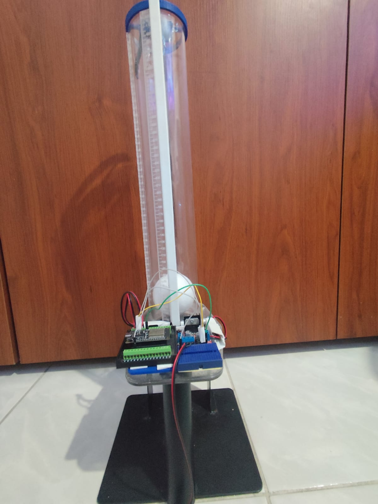
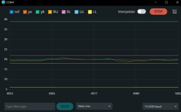

# 🎮 Ball Levitation Control — Adaptive & Intelligent Controllers

<div align="center">


**A comprehensive collection of 13 adaptive and intelligent control algorithms for a ball levitation plant, implemented on ESP32 with real-time telemetry.**

[Classical](#classical-controllers) · [Intelligent](#intelligent-controllers) · [Quick Start](#-quick-start) · [Hardware](#-hardware)

</div>

---

## About

This repository contains **13 different control strategies** designed to regulate the height of a levitating ball using a PWM-controlled fan. The plant uses an **HC-SR04 ultrasonic sensor** for distance measurement and an **ESP32** microcontroller for real-time processing.

<p align="center">
  
</p>

The controllers are divided into two categories:
- **Classical / Semi-Adaptive**: PID, Generalized Polynomial, and State-Space controllers with online Recursive Least Squares (RLS) estimation
- **Intelligent**: Neural Network (RLS-based inverse model) and Fuzzy Logic controllers

All controllers feature **online system identification** — the plant model is estimated in real-time, making them robust to parameter changes and disturbances.

---

## Architecture

```
                    ┌──────────────┐
                    │   Teleplot   │ ← UDP telemetry
                    │  (PC Graph)  │
                    └──────┬───────┘
                           │ WiFi/UDP
                           ▼
┌──────────┐    PWM    ┌──────────┐    Echo    ┌──────────┐
│  DC Fan  │◄──────────│  ESP32   │◄───────────│ HC-SR04  │
│ (Plant)  │           │  (MCU)   │            │ (Sensor) │
└──────────┘           └──────────┘            └──────────┘
     │                      ▲                       │
     │    Air pressure      │    Serial terminal    │
     ▼                      │    Serial terminal    │
┌──────────┐                │                       │
│  Ball    │  Distance ─────┼───────────────────────┘
│ (Object) │                │
└──────────┘           Control Law
                    u(k) = f(y, ref, θ)
```

### Real-Time Telemetry (Teleplot)

Data from the controllers is sent via UDP to Teleplot for live monitoring and tuning.

<p align="center">
  
</p>

---

## Classical Controllers

Semi-adaptive controllers with **RLS online estimation** that identify the plant model in real-time and compute control coefficients via pole placement.

### Arduino (C++)

| # | Controller | Model Order | Description |
|---|-----------|-------------|-------------|
| 1 | **PID Type 1** | 1st order | Classic PID with pole placement, RLS estimator |
| 2 | **PID Type 2** | 2nd order | PID via Diophantine equation, 4-coefficient solution |
| 3 | **Polynomial (with integral)** | 3rd order | Sylvester matrix solver, integral action via Δ operator |
| 4 | **Polynomial (without integral)** | 3rd order | Same structure, no integral action for faster response |

### MicroPython

| # | Controller | Description |
|---|-----------|-------------|
| 5 | **Polynomial + Direct Gain (Kg)** | Diophantine solver + loop gain for zero steady-state error |
| 6 | **Reduced State-Space + Kg** | State feedback with direct loop gain |
| 7 | **Reduced State-Space + Integral** | State feedback with integral action |
| 8 | **Extended State-Space + Kg** | Extended observer + direct loop gain |
| 9 | **Extended State-Space + Integral** | Extended observer + integral action |

---

## Intelligent Controllers

Controllers based on **neural networks** and **fuzzy logic** that learn or encode nonlinear control strategies.

### Neural Networks (MicroPython)

| # | Controller | Description |
|---|-----------|-------------|
| 10 | **NN Inverse Model** | Pure inverse model control — RLS learns the plant, then inverts it |
| 11 | **NN + PID Hybrid** | Fixed PID (feedback) + NN inverse model (feedforward correction) |

### Fuzzy Logic (Arduino)

| # | Controller | Rule Base | Description |
|---|-----------|-----------|-------------|
| 12 | **Fuzzy 49 Rules** | 7×7 | Gaussian membership functions, centroid defuzzification |
| 13 | **Fuzzy 81 Rules** | 9×9 | Finer granularity for improved precision |

---

## 🚀 Quick Start

### Prerequisites

- [ESP32 DevKit](https://www.espressif.com/) (any variant with WiFi)
- [Arduino IDE](https://www.arduino.cc/en/software) or [Thonny](https://thonny.org/) (for MicroPython)
- [Teleplot](https://github.com/nicollier/teleplot) (optional, for real-time graphing via UDP)

### For Arduino Controllers (.ino)

1. Install **Arduino IDE** and add ESP32 board support
2. Install the **BasicLinearAlgebra** library (for PID/Polynomial controllers)
3. Open the desired `.ino` file
4. Update `WIFI_SSID`, `WIFI_PASS`, and `TELEPLOT_IP` with your network settings
5. Select your ESP32 board and upload

### For MicroPython Controllers (.py)

1. Flash **MicroPython** firmware with **ulab** support onto your ESP32
2. Open the desired `.py` file in Thonny or your preferred IDE
3. Update `WIFI_SSID`, `WIFI_PASS`, and `TELEPLOT_IP` with your network settings
4. Upload and run

### Changing the Reference Setpoint

All controllers accept a new reference via **serial terminal**. Simply type a number (in cm) and press Enter:
```
21        → Sets reference to 21 cm
15.5      → Sets reference to 15.5 cm
```
Valid range: **7 – 35 cm**

---

## 🔧 Hardware

### Bill of Materials

| Component | Specification | Purpose |
|-----------|--------------|---------|
| ESP32 DevKit V1 | Any variant | Microcontroller |
| HC-SR04 | Ultrasonic sensor | Distance measurement (4–40 cm) |
| DC Fan | 12V brushless | Actuator (PWM controlled) |
| Ping-pong ball | Standard 40mm | Levitating object |
| Vertical tube | ~50 cm transparent | Guides the ball |
| MOSFET driver | IRF520 or similar | Fan PWM interface |
| Power supply | 12V 2A | Fan power |

### Pin Mapping (ESP32)

| Pin | GPIO | Function |
|-----|------|----------|
| TRIG | 14 | HC-SR04 trigger |
| ECHO | 13 | HC-SR04 echo |
| PWM | 27 | Fan speed control |

---

## Project Structure

```
ball-levitation-control/
├── classical/
│   ├── arduino/
│   │   ├── pid_type_1/                  # PID Type 1 (1st order)
│   │   ├── pid_type_2/                  # PID Type 2 (2nd order)
│   │   ├── polynomial_with_integral/    # Polynomial + integral action
│   │   └── polynomial_without_integral/ # Polynomial without integral
│   └── micropython/
│       ├── polynomial_direct_gain.py    # Polynomial + Kg
│       ├── reduced_state_space_direct_gain.py
│       ├── reduced_state_space_integral.py
│       ├── extended_state_space_direct_gain.py
│       └── extended_state_space_integral.py
├── intelligent/
│   ├── micropython/
│   │   ├── nn_inverse_model.py          # Pure NN inverse control
│   │   └── nn_pid_hybrid.py             # NN + PID hybrid
│   └── arduino/
│       ├── fuzzy_49_rules/              # Fuzzy logic 7×7
│       └── fuzzy_81_rules/              # Fuzzy logic 9×9
├── docs/
│   └── setup_guide.md                   # Complete setup guide
├── .gitignore
├── LICENSE
└── README.md
```

---

## License

This project is licensed under the MIT License — see the [LICENSE](LICENSE) file for details.

---

## Author

**Jhoan Felipe Delgado Acevedo** — Mechatronics Engineer

* LinkedIn: [Jhoan Felipe Delgado Acevedo](https://www.linkedin.com/in/jhoan-felipe-delgado-acevedo-8240a2355)

> *Developed at [Universidad Tecnológica de Pereira (UTP)](https://www.utp.edu.co/) — Advanced Control Systems course.*

---

<div align="center">
  <sub>By FelipeJDA</sub>
</div>
