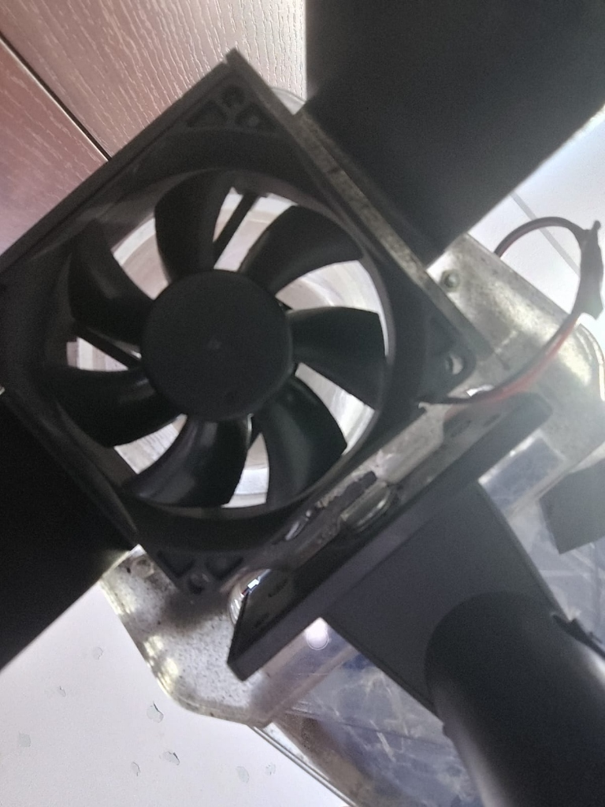
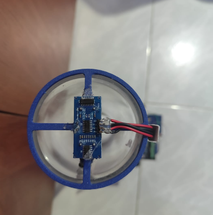
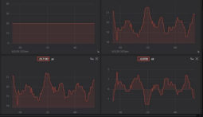

# Complete Setup Guide — Ball Levitation Control

## Table of Contents
1. [Hardware Assembly](#1-hardware-assembly)
2. [Arduino Setup](#2-arduino-setup)
3. [MicroPython Setup](#3-micropython-setup)
4. [Teleplot Configuration](#4-teleplot-configuration)
5. [Controller Selection Guide](#5-controller-selection-guide)
6. [Troubleshooting](#6-troubleshooting)

---

## 1. Hardware Assembly

### Wiring Diagram

```
ESP32 DevKit V1
┌────────────────────┐
│                    │
│  GPIO 14 (TRIG) ──┼──► HC-SR04 TRIG
│  GPIO 13 (ECHO) ──┼──► HC-SR04 ECHO (use voltage divider 5V→3.3V)
│  GPIO 27 (PWM)  ──┼──► MOSFET Gate (IRF520 module)
│  GND            ──┼──► Common ground
│  3.3V           ──┼──► HC-SR04 VCC (or 5V if module supports it)
│                    │
└────────────────────┘

MOSFET Module (IRF520)
┌────────────────────┐
│  SIG ◄── GPIO 27   │
│  VCC ◄── 5V        │
│  GND ◄── GND       │
│  V+  ◄── 12V PSU   │
│  V-  ──► Fan (-)   │
└────────────────────┘
```

<p align="center">
  
  &nbsp;&nbsp;
  
</p>

### Physical Setup

1. Mount the **transparent tube** vertically (approximately 50 cm tall)
2. Place the **DC fan** at the bottom of the tube, blowing upward
3. Mount the **HC-SR04 sensor** at the top of the tube, pointing downward
4. Place the **ping-pong ball** inside the tube
5. Connect all wiring as shown above
6. Power the ESP32 via USB and the fan via 12V power supply

> **⚠️ IMPORTANT**: The HC-SR04 outputs 5V on the ECHO pin. Use a voltage divider (two resistors: 1kΩ + 2kΩ) to step it down to 3.3V for the ESP32 GPIO.

---

## 2. Arduino Setup

### 2.1 Install Arduino IDE

1. Download and install [Arduino IDE](https://www.arduino.cc/en/software)
2. Go to **File → Preferences**
3. In **Additional Board Manager URLs**, add:
   ```
   https://raw.githubusercontent.com/espressif/arduino-esp32/gh-pages/package_esp32_index.json
   ```
4. Go to **Tools → Board → Boards Manager**, search for **ESP32** and install

### 2.2 Install Required Libraries

For the **PID** and **Polynomial** controllers, install:
- **BasicLinearAlgebra** by Tom Stewart (via Library Manager)

The **Fuzzy Logic** controllers have no external dependencies.

### 2.3 Upload a Controller

1. Open the desired `.ino` file (e.g., `pid_type_1/pid_type_1.ino`)
2. Select **Tools → Board → ESP32 Dev Module**
3. Select the correct **COM port**
4. If using Teleplot, update the WiFi and IP settings at the top of the file
5. Click **Upload**
6. Open **Serial Monitor** at 115200 baud

---

## 3. MicroPython Setup

### 3.1 Flash MicroPython with ulab

The MicroPython controllers require **ulab** (a NumPy-like library for embedded).

1. Download a MicroPython firmware that includes ulab from:
   - [micropython-ulab releases](https://github.com/v923z/micropython-ulab/releases)
   - Select the **ESP32** variant
2. Flash using `esptool`:
   ```bash
   pip install esptool
   esptool.py --port COM3 erase_flash
   esptool.py --port COM3 write_flash -z 0x1000 firmware.bin
   ```

### 3.2 Upload a Controller

1. Open **Thonny** (or any MicroPython IDE)
2. Connect to your ESP32
3. Open the desired `.py` file
4. Update `WIFI_SSID`, `WIFI_PASS`, and `TELEPLOT_IP` at the top
5. Upload and run

---

## 4. Teleplot Configuration

[Teleplot](https://github.com/nicollier/teleplot) is a real-time plotting tool that receives data via UDP.

### 4.1 Install Teleplot

- **VS Code Extension**: Search for "Teleplot" in the VS Code marketplace
- **Standalone**: Download from the GitHub releases page

### 4.2 Configure

1. Start Teleplot and note the UDP port (default: `47269`)
2. Find your PC's local IP address:
   ```bash
   ipconfig    # Windows
   ifconfig    # Linux/Mac
   ```
3. Update the controller code:
   ```python
   TELEPLOT_IP   = "192.168.1.100"   # Your PC IP
   TELEPLOT_PORT = 47269              # Teleplot port
   ```
4. The controller will send `ref`, `yk`, `ye`, `ek`, and `u` as real-time graphs

<p align="center">
  
</p>

---

## 5. Controller Selection Guide

| Goal | Recommended Controller |
|------|----------------------|
| **Simple, fast setup** | PID Type 1 (Arduino) |
| **Better tracking** | PID Type 2 (Arduino) |
| **Zero steady-state error** | Polynomial + Kg (MicroPython) |
| **Disturbance rejection** | State-Space + Integral (MicroPython) |
| **AI-based control** | NN Inverse Model (MicroPython) |
| **Robust + AI** | NN + PID Hybrid (MicroPython) |
| **No model needed** | Fuzzy Logic 49 or 81 Rules (Arduino) |

---

## 6. Troubleshooting

### Sensor reads 0 or erratic values
- Check wiring (TRIG → GPIO 14, ECHO → GPIO 13)
- Verify voltage divider on ECHO pin
- Ensure the ball is within 4–40 cm range

### Ball oscillates wildly
- Reduce the controller aggressiveness by increasing the pole value (e.g., 0.5 → 0.7)
- Check if the fan is properly mounted and blowing upward

### WiFi connection fails
- Ensure the ESP32 is within range of your WiFi router
- Verify SSID and password in the code
- The controller will still work without WiFi (Teleplot just won't receive data)

### RLS estimator diverges (theta values grow large)
- Reset the ESP32 to reinitialize the covariance matrix
- Try a different forgetting factor (LAMBDA: 0.95–0.99)

### MicroPython "ImportError: no module named ulab"
- You need a MicroPython firmware compiled with ulab support
- Download the correct build from the ulab GitHub releases

---

> *Guide created for the Advanced Control Systems course at Universidad Tecnológica de Pereira (UTP).*
